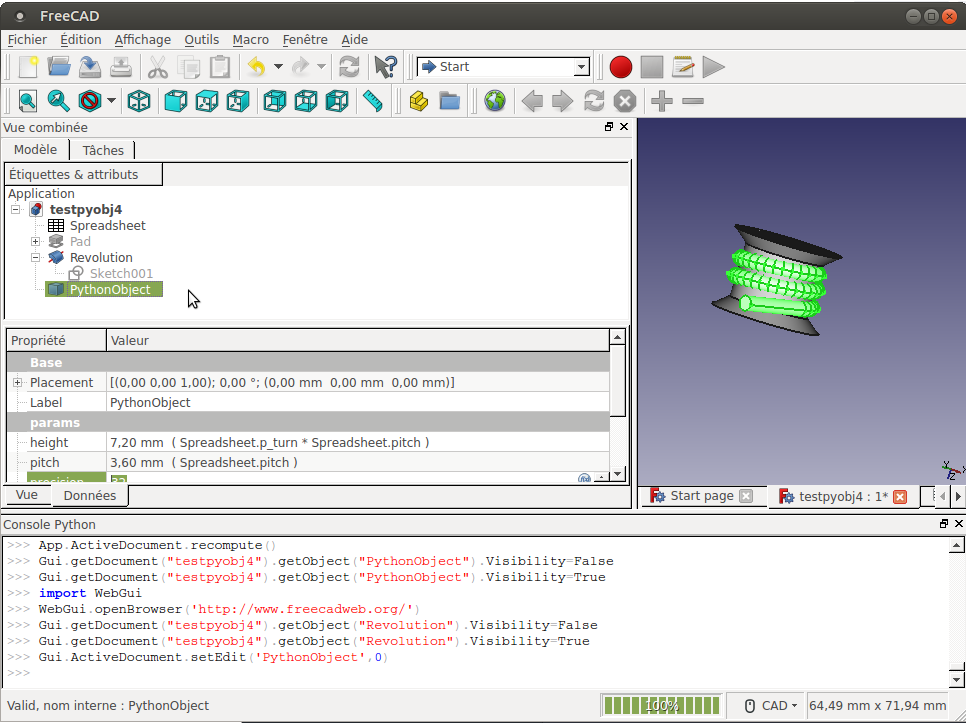
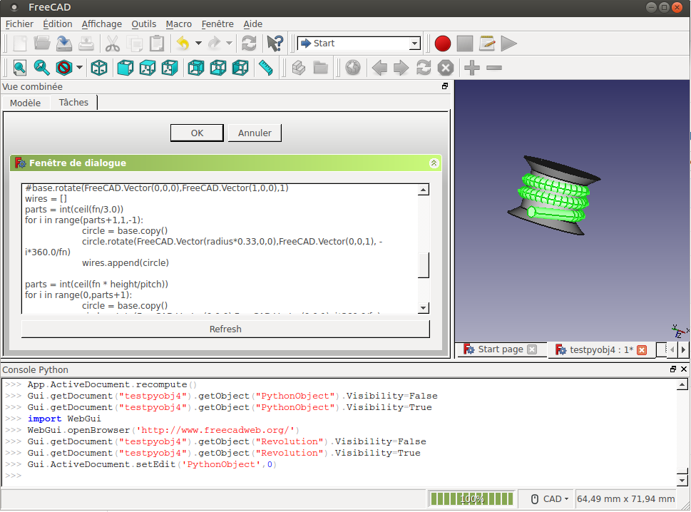

# FreeCAD_Python
Create object with custom python script directly embedded inside the object. Script is edited in Freecad Editor and saved inside .FCStd project file. This module can be used to rapid prototyping python object script without module setup

